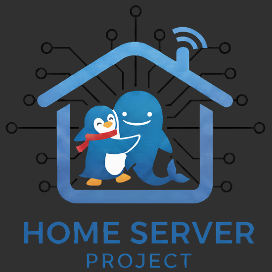

<p align="center">

</p>

# home-server

## 👁️ Project Overview

This repository contains the configuration for a personal home server, designed to run essential home services using Docker containers. The goal is to create a centralized, modular, and easily reproducible environment for managing network services, home automation, and data storage.

By using a single `docker-compose.yml` file, all services and their dependencies are defined in one place, simplifying setup and ensuring consistent deployment. This approach allows for easy scalability by adding or removing services as needed.

## 🔑 Key Services

The project currently includes configurations for the following services:

* **[PostgreSQL](https://www.postgresql.org/):** A robust relational database for data storage. It's used by Home Assistant and can be used by any other service or customized application you build.
* **[nginx](https://nginx.org/):** A high-performance web server, reverse proxy, and load balancer. The main role of nginx is to provide forwarding from any web interface the services may have to a subdomain, ensuring all services use HTTPS when accessed.
* **[Pi-Hole](https://pi-hole.net/):** A network-wide ad and tracker blocking DNS server.
* **[Home Assistant](https://www.home-assistant.io/):** A powerful open-source home automation platform for local control of smart devices.
* **[Komodo](https://komo.do/):** A tool to provide structure for managing your servers, builds, deployments, and automated procedures.
* **[Webmin](https://webmin.com/):** A system administration tool for Unix-like servers and services (optional).

💡 Webmin support is an optional component selected during installation. While the following documentation references Webmin, you may ignore all related sections if you did not install it.

**Future services:** The modular design allows for the easy addition of other services, such as media servers, file storage, and more.

## 🌐 Domain and Subdomains

The domain for all web services is defined during installation. This project automatically creates the chosen domain and corresponding subdomains for each service with a web interface.

Using the example domain `homeserver.lan`, the following subdomains would be generated:

- `pihole.homeserver.lan` for Pi-Hole
- `ha.homeserver.lan` for Home Assistant
- `komodo.homeserver.lan` for Komodo
- `webmin.homeserver.lan` for Webmin

The setup also generates a self-signed certificate for the domain and all subdomains. A `ca.crt` file is provided, which you can install on your devices to ensure browsers recognize the HTTPS certificates within your local network. All services are proxied through nginx.

## 🚀 Getting Started

### Prerequisites

* [**Docker**](https://docs.docker.com/get-docker/)
* [**Docker Compose**](https://docs.docker.com/compose/install/) (v2 or superior)

### Installation and Deployment

The installation is managed by an interactive script that sets up a clean production environment, separate from the Git repository.

1.  **Clone the Repository:**

    ```bash
    git clone https://github.com/danielcdias/home-server.git
    cd home-server
    ```

2.  **Create the Secrets File (`.env`):**
    Copy the example file `.env.example` to `.env` and fill in all the necessary passwords and secrets.

    ```bash
    cp .env.example .env
    nano .env
    ```
    **This step is crucial.** The `.env` file will contain all your passwords.

3.  **Create PostgreSQL Initial User Configuration:**
    Create the `./postgres/config/config.json` file with the databases to be created when PostgreSQL starts. For example, the Home Assistant database:

    ```json
    [
        {
            "db_name": "home_assistant",
            "user": "homeassistant",
            "password": "a_strong_password"
        }
    ]
    ```
    ⚠️ **ATTENTION!** The database information here MUST BE THE SAME as defined in the `.env` file.

4.  **Run the Installation Script:**
    Execute the `install.sh` script with `sudo`. It will guide you through the configuration process.

    ```bash
    sudo ./install.sh
    ```
    The script will ask for:
    * **Installation Directory:** The location where the runtime files will be stored (default: `/opt/home-server`).
    * **Domain Name (Hostname)**: The base name for accessing your services (default: the machine's hostname).
        
        ⚠️ **Attention**: **It is highly recommended** that you use the default value, which is your machine's actual hostname. The local DNS (Pi-hole), part of this project, is automatically configured so that this name points to your server's correct IP address, ensuring everything works out of the box.
        
        If you choose a domain name different from the machine's hostname (e.g., `my-server`), the services will not be accessible over the network until you manually configure a "DNS Record" in the Pi-hole dashboard, pointing your custom domain to the server's IP address. The customization option is intended for advanced users who understand this need.

    * **Domain Suffix:** Your local network's suffix (default: `lan`).
    * **Webmin Support:** Whether you want to install and configure Webmin.

5.  **Start the Services:**
    After the script finishes, the `homeserver.service` systemd service will be created and enabled. You can start the services immediately with:

    ```bash
    sudo systemctl start homeserver.service
    ```
    To check the status, use `sudo systemctl status homeserver.service`. The services will also start automatically with the system.

## 📡 Available Services

After installation, the services will be available through a secure reverse proxy with HTTPS encryption at the following addresses (replace `homeserver.lan` with your chosen domain):

- **Central Dashboard**: `https://homeserver.lan/`
- **Pi-hole**: `https://pihole.homeserver.lan/admin/`
- **Home Assistant**: `https://ha.homeserver.lan/`
- **Komodo**: `https://komodo.homeserver.lan/`
- **Webmin**: `https://webmin.homeserver.lan/`

## ⚙️ Additional Configuration Notes

### SSL Certificates

The self-signed certificates generated during installation need to be trusted on your devices:

1. Locate the `ca.crt` file in your installation directory (e.g., `/opt/home-server/nginx/ssl/ca.crt`).
2. Import it into your device's or browser's trusted root certificate authorities. This will prevent security warnings.

### Network Considerations

- Ensure your router is configured to use Pi-Hole as the DNS server for your network.
- The nginx reverse proxy uses port 80 (HTTP) and 443 (HTTPS).
- Make sure these ports are forwarded correctly if accessing from outside your network.

### Backup Recommendations

Regularly backup:

- PostgreSQL databases using `pg_dump`.
- Docker volumes containing application data (e.g., `mongo-data`, `postgres_data`).
- The installation directory, which contains your configuration files (`config.env`, `.env`, etc.).

### Uninstallation

To completely remove the project, run the `uninstall.sh` script.

You must execute the script from the **installation directory** (for example, `/opt/home-server`), not from the source code folder where you cloned the repository. The script also requires superuser privileges.

For example, if your installation directory is `/opt/home-server`, run the following commands:

```bash
cd /opt/home-server
sudo ./uninstall.sh
```
The uninstallation process will perform the following actions:

- Stop and disable the homeserver.service systemd unit.
- Permanently delete all Docker volumes created by the project.
- Remove the entire installation directory.

  ⚠️ Warning: This action is destructive and irreversible. It will permanently delete all data, including the PostgreSQL database, information in other Docker volumes, and all configuration files. Proceed with extreme caution.

## 📊 Project Status

The project is currently under development.

## 🤝 Contributing

Feel free to submit issues and enhancement requests.

## 📜 Disclaimer

As per the GNU General Public License v3.0 included in this project, this software is distributed in the hope that it will be useful, but **WITHOUT ANY WARRANTY**; without even the implied warranty of **MERCHANTABILITY** or **FITNESS FOR A PARTICULAR PURPOSE**.

The entire risk as to the quality and performance of the program is with you. This project makes no provision for data backup, security, or disaster recovery. By using this software, you assume full responsibility for any and all data loss or system failure.

In no event shall the authors or copyright holders be liable for any claim, damages, or other liability. You are using this software solely **at your own risk**.

For the full terms and conditions, please see the `LICENSE` file.
